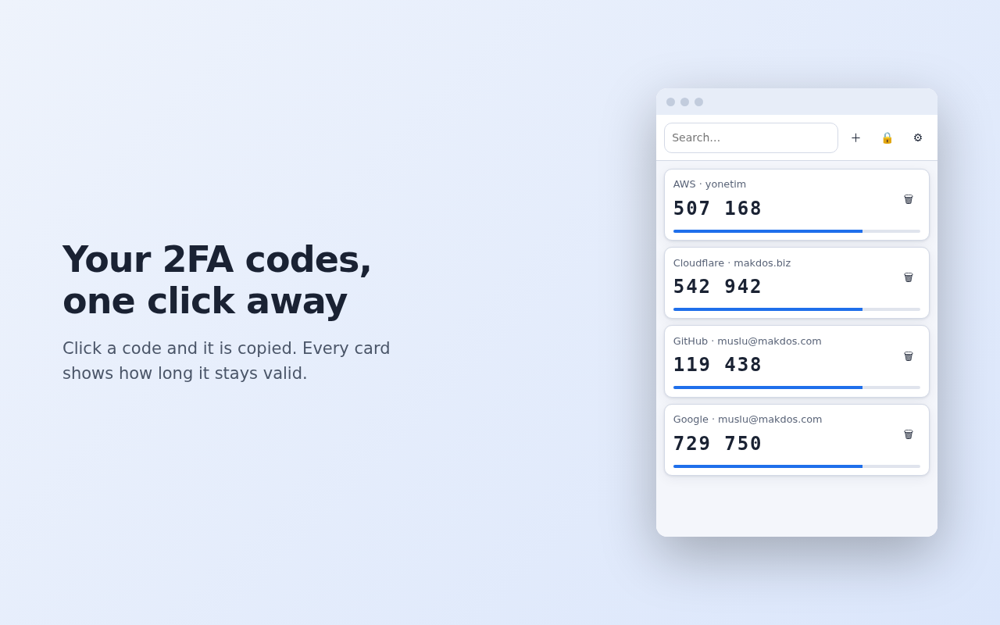

# exte — 2FA Authenticator for Chrome

Two-factor authentication codes in your browser. No account, no server, **no network
permission** — your secrets never leave your device.

[](LICENSE)


<p align="center">
  
</p>

## Features

- **TOTP and HOTP** — SHA-1 / SHA-256 / SHA-512, 6–8 digits, 30 or 60 second periods
- **One click to copy** — every card shows the remaining time as a bar
- **Four ways to add an account**
  - scan a QR code visible on screen
  - pick a QR image file, or paste one from the clipboard
  - paste an `otpauth://` link
  - enter it manually
- **Encrypted backup** — password-protected export (PBKDF2-SHA256 + AES-256-GCM)
- **`otpauth://` list export** (`.txt`) — compatible with other authenticator apps
- **Import from Google Authenticator** — reads the "Transfer accounts" QR code directly
- **Password required** — set on first run (PBKDF2-SHA256 310k + AES-256-GCM); no recovery,
  by design. Asked for every time you open the extension, or after an idle period you choose
  (up to 30 days)
- **English and Turkish** UI, light and dark theme

## Install

Not on the Chrome Web Store yet. To run it now:

1. Download this repository (or the latest `exte-*-paylas.zip` from Releases) and unzip it
2. Open `chrome://extensions`
3. Turn on **Developer mode** (top right)
4. Click **Load unpacked** and select the `exte` folder
5. Click the 🔒 icon in the toolbar and set your password — it is asked for on every open and
   cannot be recovered, so pick one you will remember

## Migrating from Google Authenticator

On your phone: **Google Authenticator → ⋮ → Transfer accounts → Export accounts**, select the
accounts, and a QR code appears. Get that QR onto your computer as an image (a screenshot, or a
photo taken with another camera — both work).

Then: extension icon → **⚙** → *Import from Google Authenticator* → **Choose QR image…**

With many accounts Google splits the export into several QR codes. exte tells you which part it
just read (`part 1 of 3`) so you can load the rest.

## Back up

If you lose your browser profile without a backup, or forget the password you set on first run,
your accounts cannot be recovered — there is no reset path, by design.

**⚙ → Export → enter a password → Download encrypted JSON.** Keep the file somewhere safe.

The `.txt` export is **not encrypted** — it contains your secret keys in plain text. Use it only
to move accounts into another app, then delete it.

## Privacy

The extension declares no `host_permissions` and contains no network calls, so it cannot send
your data anywhere even if it wanted to. Full policy: [PRIVACY.md](PRIVACY.md).

Permissions requested:

| Permission | Why |
|---|---|
| `storage` | Keeps your accounts and settings on your device |
| `activeTab` | Only when you click "Scan from screen", to read the QR code from the visible tab |
| `clipboardWrite` | Copies the code you click to your clipboard |

## Verification

The TOTP/HOTP engine is checked against the official test vectors from **RFC 4226 Appendix D**
and **RFC 6238 Appendix B** (SHA-1, SHA-256 and SHA-512). The QR path, the Google Authenticator
protobuf decoder, the encrypted backup round-trip and the password flow (setup, unlock, change,
re-lock) all have tests too.

```bash
node --test tests/     # 29 tests, no dependencies to install
```

## Development

No build step, no npm, no bundler — the folder you clone is the extension that runs.
See [DEVELOPMENT.md](DEVELOPMENT.md) for the architecture, the deliberate design decisions
and the pitfalls worth knowing before changing anything.

## License

[MIT](LICENSE). Bundles [jsQR](https://github.com/cozmo/jsQR) (MIT) for QR decoding.
